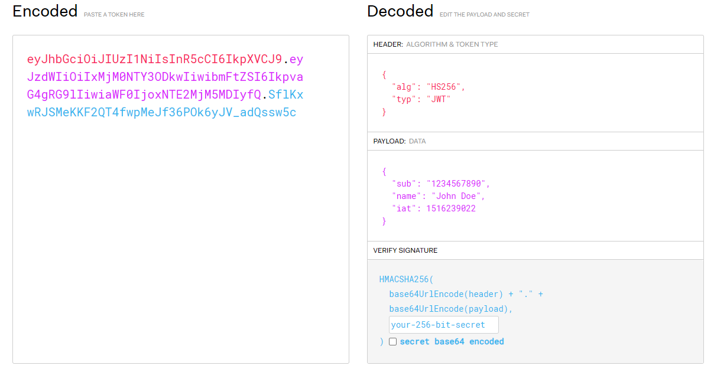

class: inverse, center, middle

# Spring Security általános bemutatása

## &nbsp;

---

## Spring Security

* Keretrendszer
  * Java nyelven írt, nyílt forrású
  * Hitelesítés (authentication): annak ellenőrzése, hogy a felhasználó valóban az, akinek mondja magát (pl. jelszóval, kétfaktoros hitelesítéssel)
  * Engedélyezés (authorization): annak eldöntése, hogy egy hitelesített felhasználó milyen erőforrásokhoz férhet hozzá
  * Védelmi mechanizmusok a gyakori támadási módok ellen  
  * Spring alkalmazásokhoz könnyen illeszthető, akár Servlet alapú, akár Reactive alkalmazásokhoz
  * Integráció más eszközökhöz, pl. Spring Data, JSP/Thymeleaf/stb. template
  * Könnyen tesztelhető

---

## Gyakori használati esetek hitelesítés esetén

* Webes alkalmazás felhasználónév és jelszó alapú autentikációval, sessionnel
* REST API-val rendelkező alkalmazás, JWT token kiadásával és ellenőrzésével, állapotmentes módon
* OAuth 2.0 és OpenID Connect

---

## Főbb jellemzők

* Űrlap alapú bejelentkezés, Remember me funkcionalitás
* Basic authentication
* Jelszó hash-elés
* Tanúsítvány alapú hitelesítés
* Felhasználók tárolása adatbázisban
* Felhasználók tárolása LDAP szerveren

---

## Engedélyezés

* URL alapú védelem
* Metódus szintű védelem (annotációk használatával)
* Access Controll List (ACL)

---

## Védelmi mechanizmusok

* Security Headers, pl. HTTP Strict Transport Security (HSTS), Content Security Policy (CSP), stb.
* Cross Site Request Forgery (CSRF)
* Illegális kérések kiszűrése

---

class: inverse, center, middle

# Architektúra Servlet környezetben

## &nbsp;

---

## Architektúra Servlet környezetben


---

## Naplózás

```yaml
logging:
  level:
    org.springframework.security: trace
```

---

## Spring Boot Autoconfiguration

* Secure by Default: alapértelmezett beállítások biztonságossá teszik az alkalmazást
* Principle of Least Privilege: felhasználóknak a legkevesebb hozzáférést adjuk, hogy a munkáját el tudja végezni
* `HttpSecurityConfiguration` létrehoz a `httpSecurity()` metódusban egy `HttpSecurity` példányt 
* `UserDetailsServiceAutoConfiguration`
* `SecurityAutoConfiguration`
  * Import `SpringBootWebSecurityConfiguration`
    * `HttpSecurity` injektálása, `build()` metódussal egy `DefaultSecurityFilterChain` létrehozása
    * Minden URL védett
    * Form login és Basic authentication (Content negotiation alapján)
    * `@EnableWebSecurity` annotáció, így nem kell kitenni
  * `DefaultAuthenticationEventPublisher` események publikálására

---

class: inverse, center, middle

# Authentication és Principal

## &nbsp;

---

## Principal

* Fogalom, nincs hozzá interfész vagy osztály
* Felhasználót reprezentál
* Tipikusan `UserDetails` példány

---

## Authentication

* `org.springframework.security.core.Authentication`
* Bejelentkezés tényét reprezentálja
* Metódusai:
  * `getName()`
  * `getCredentials()`
  * `getAuthorities()`, `GrantedAuthority` példányok (`SimpleGrantedAuthority`)
  * `getDetails()`, pl. IP cím
  * `getPrincipal()`, `Object` típusú
  * `isAuthenticated()`
* `extends javax.security.Principal`, `getName()` metódussal
* `UsernamePasswordAuthenticationToken` implementálja

---

## SecurityContext

* `SecurityContextHolder`-től kérhető le
* `getAuthentication()` metódusa van

---

class: inverse, center, middle

# Bejelentkezés felhasználónévvel és jelszóval

---

## Bejelentkezés felhasználónévvel és jelszóval


---

class: inverse, center, middle

# JWT

## &nbsp;

---

## JWT

* Három részből áll: Header, Payload, Signature
* JSON dokumentumok, így struktúrált adat tárolható benne
* Mezőit claimeknek nevezi
* Saját claimeket is definiál: `iss` (Issuer), `sub` (Subject), `iat` (Issued at), `exp` (Expiration)
* BASE64-gyel kódolva, hiszen így adható át könnyen webes környezetben

JSON Web Token (JWT) ([RFC 7519](https://datatracker.ietf.org/doc/html/rfc7519))

---

## JWT



---

## Specifikáció gyűjtemény

* JavaScript Object Signing and Encryption (JOSE)
  * JSON Web Token (JWT) ([RFC 7519](https://datatracker.ietf.org/doc/html/rfc7519)): két BASE64 kódolt JSON
  * JSON Web Signature (JWS) ([RFC 7515](https://datatracker.ietf.org/doc/html/rfc7515)): elektronikus aláírás
  * JSON Web Encryption (JWE) ([RFC 7516](https://datatracker.ietf.org/doc/html/rfc7516)): titkosítás
  * JSON Web Algorithms (JWA) ([RFC 7518](https://datatracker.ietf.org/doc/html/rfc7518)): algoritmusok
  * JSON Web Key (JWK) ([RFC 7517](https://datatracker.ietf.org/doc/html/rfc7517)): kulcsok JSON formátumban

---

class: inverse, center, middle

# OAuth 2.0

## &nbsp;

---

## OAuth 2.0

* Nyílt szabány **erőforrás-hozzáférés** kezelésére (Open Authorization)
* Engedélyezésre (authorization) koncentrál, és nem a hitelesítésre (authentication)
* Fő használati területe a web, de kitér az asztali alkalmazásokra, mobil eszközökre, okos eszközökre, stb.
* **Elválik**, hogy hol történik a felhasználó hitelesítése (Authorization Server) és hol kíván erőforráshoz hozzáférni (Resource Server)
  * Google, GitHub, Facebook vagy saját szerver
* Authorization Server a hitelesítés után Access Tokent állít ki
* A Resource Server az Access Token alapján adja meg az engedélyt az adott erőforrás elérésére, pl. egy REST API-n elérhető alkalmazás
* A Client további alkalmazás, mely a felhasználó nevében próbál hozzáférni a Resource Serveren lévő erőforráshoz, pl. webalkalmazás vagy mobilalkalmazás

The OAuth 2.0 Authorization Framework ([RFC 6749](https://datatracker.ietf.org/doc/html/rfc6749))

---

## Token

* Karaktersor, melynek birtokában az erőforrás elérhető
* Bearer Token, mely HTTP kéréskor a `Authorization` fejlécben küldhető át
* Opaque token: felhasználója számára nem tartalmaz információt
  * Információkat az Authorization Servertől a token birtokában a Token Introspection végponton lehet lékérni (`/token/introspect`)
* Non-opaque token: felhasználója közvetlenül ki tudja olvasni az adatot
  * Lehet JWT formátumú, JSON formátumban, BASE64-gyel kódolva

OAuth 2.0 Token Introspection ([RFC 7662](https://datatracker.ietf.org/doc/html/rfc7662))

---

## OAuth 2.0 Grant Types

* Authorization Code: URL-ben az Authorization Servertől egy Authorization Code-ot kapunk, mellyel lekérhető háttérben az Access Token
* Implicit: mobil alkalmazások, vagy SPA-k használták, azonnal Access Tokent kap URL-ben (deprecated)
* Resource Owner Password Credentials: ezt olyan megbízható alkalmazások használják, melyek maguk kérik be a jelszót, nem kell átirányítás (deprecated)
* Client Credentials: ebben az esetben nem a felhasználó kerül azonosításra, hanem az alkalmazás önmaga

---

## PKCE

* Ha a támadó valamilyen módon megszerzi az Authorization Code-ot (code interception támadás), kérhet vele Access Tokent
* A PKCE egy biztonsági mechanizmus, mely plusz kódok és azok ellenőrzésével ezt kivédi
* Public client: mobil alkalmazások, SPA alkalmazások, ahol a client secret nem tárolható
  * Különösen fontos
  * Kiváltja az Implicit Grant Type-ot
* Confidental client: webes alkalmazás, client secret tárolható
  * Ennél is ajánlott
* OAuth 2.1 alapértelmezett része

Proof Key for Code Exchange by OAuth Public Clients (PKCE) ([RFC 7636](https://datatracker.ietf.org/doc/html/rfc7636))

---

##  Protocol Endpoints

* Authorization Serveren
* Authorization Endpoint (`/auth`)
  * Ide történik az átirányítás, ha a felhasználó nincs bejelentkezve
  * Itt történik a hitelesítés, a szabvány nem rendelkezik, hogy hogyan
* Token Endpoint (`/token`)
  * Itt kérhetők le a tokenek

---

## Refresh token

* Access token rövid életű, hogyha a támadó megszerzi, lejárat után nem tudja használni
* Refresh token hosszú életű, segítségével új Access token kérhető
* Nem használható API hívásokban, kizárólag Access token lekérésére

---

## OAuth 2.1

* OAuth 2.0 egyszerűsített és biztonságosabb verziója
* Egyesíti az OAuth 2.0 legjobb gyakorlatait, és eltávolítja a korábban nem biztonságos vagy elavult mechanizmusokat
* Még nem végleges
* Újdonságai:
  * Implicit Flow teljes eltávolítása 
  * Resource Owner Password Credentials teljes eltávolítása
  * PKCE kötelezővé tétele minden kliens számára
  * Public client felé korlátozott Refresh token
    * Vagy Refresh Token Rotation kell
    * Vagy nem használható Refresh token
  * Access token csak HTTPS-en küldhető

---

class: inverse, center, middle

# OpenID Connect

## &nbsp;

---

## OpenID Connect 1.0 Core

* Míg az OAuth 2.0 csak az engedélyezésre koncentrál, az OpenID Connect a hitelesítésre
* OpenID Connect 1.0 egy simple identity layer az OAuth 2.0 protokoll felett
* OpenID Providernek (OP) nevezi az Authorization Servert
* Relying Party-nak (RP) nevezi a Clientet
* Flow-knak nevezi a Grant Type-okat
* Bevezeti a Identity Tokent, mely a felhasználó adatait tartalmazza
* JWT formátumban, mezői a claimek
* Szabványos claimeket definiál, mint `name` (név), `email` (email cím), stb.
* UserInfo Endpoint, melyen ezek az adatok lekérhetőek Access token használatával (`/userinfo`)

[OpenID Connect Core 1.0](https://openid.net/specs/openid-connect-core-1_0.html)

---

## OpenID Connect Discovery 1.0

* OpenID Provider Configuration Information
* `/.well-known/openid-configuration` címen egy JSON-t kell vissszaadnia az OP konfigurációjáról
  * Pl.: Publikus kulcsok címe, Authorization és Token endpoint címe, támogatott algoritmusok, stb.

[OpenID Connect Discovery 1.0](https://openid.net/specs/openid-connect-discovery-1_0.html)

---

## Logout

* [OpenID Connect RP-Initiated Logout](https://openid.net/specs/openid-connect-rpinitiated-1_0.html)
  * RP kezdeményezi, átirányítással
* [Session Management](https://openid.net/specs/openid-connect-session-1_0.html)
  * RP oldalán frame-ekkel
* [OpenID Connect Front-Channel Logout](https://openid.net/specs/openid-connect-frontchannel-1_0.html)
  * OP oldalán frame-ekkel
* [OpenID Connect Back-Channel Logout](https://openid.net/specs/openid-connect-backchannel-1_0.html)
  * OP és RP között direkt kommunikáció
* Több RP esetén, ha biztosítani kell a kijelentkezést mindenhol, akkor a Back-Channel Logout a legmegbízhatóbb megoldás

---

## Dynamic Client Registration

* A Relying Party regisztrálhatja magát az OpenID Provideren

[OpenID Connect Dynamic Client Registration 1.0](https://openid.net/specs/openid-connect-registration-1_0.html)

---

class: inverse, center, middle

# Authorization Code Grant Type

## &nbsp;

---

## Authorization Code Grant Types lépések


---

## További paraméterek


---

## Paraméterek leírása

* Authorization Endpoint kérésben
  * `response_type=code`: Authorization Code Grant Type
  * `client_id`
  * `scope`: `openid`
  * `state`: CSRF támadás ellen, átirányítás előtt elmenti a Client (pl. session), majd visszairányításnál visszakapja és ellenőrzi (OAuth 2.0 protokoll része)
  * `redirect_uri`: milyen címre irányítson vissza
  * `nonce` (OpenID Connect része) - Client generálja, auth server beleteszi a tokenbe, amit a client ellenőrizni tud 
* Authorization Endpoint válaszban:
  * `state`: ugyanaz, ami a kérésben elküldésre került
  * `session_state`:  [OpenID Connect Session Management](https://openid.net/specs/openid-connect-session-1_0.html)
  * `iss`: Issuer, OAuth 2.0 Authorization Server Issuer Identification ([RFC 9207](https://www.rfc-editor.org/rfc/rfc9207.html))
  * `code`: Authorization Code

---

## Token claimek

* `iss`: Issuer
* `azp`: Authorized party, megegyezik a `client_id` értékével
* `nonce`: Megegyezik a küldött `nonce` értékével

---

class: inverse, center, middle

# PKCE

## &nbsp;

---

## PKCE lépések


---

## PKCE paraméterek leírása

* Bejelentkezés előtt a kliens generál egy véletlen kódot: `code_verifier`
* Ebből készít egy `code_challenge`-t, SHA-256 hash algoritmussal
* Authorization Code kérésekor elküldi paraméterben, Base64 és URL encode után:
  * `code_challenge`
  * `code_challenge_method`: `S256`
* Mikor a code használatával tokent kér le, ezt is el kell küldenie `code_verifier` (form) paraméterként

---

class: inverse, center, middle

# Cluster-es környezet architektúrája

## &nbsp;

---

## Cluster-es környezet architektúrája

